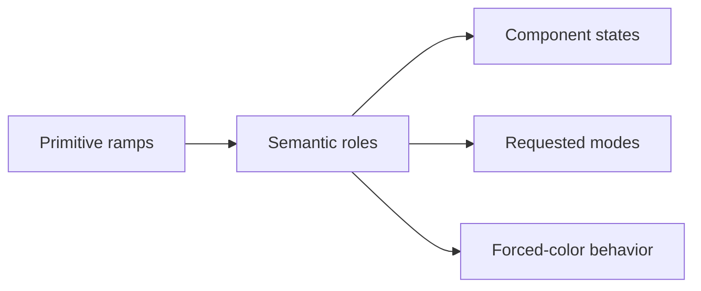

# Color System

**Source class:** terminology synthesized from the `Henry_He` series; architecture/craft guidance is supplemental; contrast criteria are normative. See [Provenance](../references/provenance.md).

## Canonical terms and adjacent boundaries

| Term | Boundary |
| --- | --- |
| **Hue / saturation / chroma / lightness** | Color family / colorfulness in a model / perceptual colorfulness / modeled light-dark position; not interchangeable. |
| **Luminance / relative luminance** | Physical or computed brightness; WCAG contrast uses relative luminance, not HSL or OKLCH lightness. |
| **Color space / gamut** | Coordinate interpretation / representable color subset. |
| **Alpha / opacity** | Compositing channel / transparency applied to an element and its composited contents. |
| **Palette / ramp** | Available collection / ordered progression for one family. |
| **Primitive / semantic color** | Context-free value / purpose-based role such as text, surface, action, focus, or status. |
| **Mode / theme** | Coordinated role mapping / named visual concept that can include color plus type, shape, imagery, and motion. |
| **Contrast ratio** | WCAG-defined relation between rendered foreground and background luminance. |

## Concise definition

A **Color System** is a governed architecture of typed values, semantic roles, modes, and tested foreground/background/state relationships.

## Why it matters

A role-based system preserves meaning across brands, platforms, states, and optional modes. It makes contrast testable and prevents a visual change from becoming a scattered search-and-replace.

## Visual model



## Decisions and tradeoffs

- Name primitives by family/step and semantic tokens by purpose. `color.text.muted` survives a palette change; `grayText` encodes appearance.
- Build ramps in a space suited to controlled interpolation. Perceptual spaces can aid authoring, but support, gamut mapping, and output fallbacks still require testing.
- Define pairs and states together: foreground/on-color, surface, border, focus, hover, selected, disabled, status, overlays, and imagery contexts.
- Keep brand, action, and status as separate roles even when values currently match.
- Treat dark mode as scoped capability: include it only when requested, existing, platform-implied, or system policy. When present, remap semantics rather than invert ramps and test hierarchy, elevation, imagery, motion, and all states.
- Wide-gamut colors increase expression on capable displays but need an intentional fallback.
- Gradients, transparency, and blend modes make contrast position- and compositing-dependent; use bounded text/icon surfaces.
- Palette choices derive from subject, brand, content, and platform. Source-specific palettes and “avoid” lists are contextual smell checks, not laws.

## Framework-neutral implementation guidance

```text
primitive: color.blue.600
semantic:  color.action.default        -> {color.blue.600}
paired:    color.on-action.default
component: button.primary.background  -> {color.action.default}  # only if justified
```

Use typed DTCG source tokens and aliases. Document color space, gamut/fallback, alpha assumptions, mode resolver, ownership, deprecation, and pairwise contrast tests. A web adapter may emit custom properties; other platforms emit native resources.

## Accessibility implications

- WCAG 2.2 SC 1.4.3 AA requires 4.5:1 for normal text and 3:1 for large text; AAA under SC 1.4.6 requires 7:1 and 4.5:1. Apply the standard’s large-text definition.
- SC 1.4.11 generally requires 3:1 for visual information needed to identify UI components, states, and meaningful graphics.
- SC 1.4.1 prohibits color as the only means of conveying meaning. Add text, icon, shape, pattern, or programmatic state.
- Calculate rendered contrast after alpha compositing and across hover, focus, disabled, selected, visited, gradient, image-overlay, and mode states.
- Preserve structure and meaning in forced-colors environments through system colors and visible boundaries.

## Common failure modes

- Product UI consumes primitive values directly → modes and brand changes scatter.
- One role serves brand, action, and status → meanings cannot evolve independently.
- Raw swatches pass but composited output fails → transparency or imagery was ignored.
- Dark mode is numeric inversion → hierarchy and elevation collapse.
- Semantic aliases describe screens rather than reusable intent → the role layer explodes.
- A source-specific trendy palette is used without context → the product loses identity.
- Disabled content becomes unreadable → visual muting is mistaken for semantic unavailability.

## Agent-ready wording and acceptance checks

> Define a Color System for **[context]** using primitive ramps and semantic text, surface, border, action, focus, and status roles. State palette rationale from brand/subject/content, requested modes, color space and fallback, rendered pair tests, forced-color behavior, and non-color cues. Use typed portable aliases and label WCAG criteria separately from stricter product policy.

**Accept when:** every role has one purpose; required states and modes resolve; all rendered pairs pass their criteria; forced colors preserve meaning; brand/status/action can diverge; no meaningful state depends on color alone.
