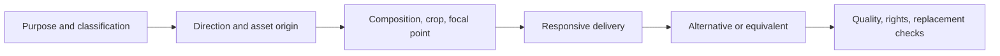

# Imagery

**Source class:** supplemental professional and contextual craft guidance; alternative-text and responsive-image behavior is normative. The supplied linux.do series has no Imagery topic. See [Provenance](../references/provenance.md).

## Canonical terms and adjacent boundaries

| Term | Boundary |
| --- | --- |
| **Informative / decorative / functional image** | Conveys information / adds no information / performs or identifies an action. |
| **Complex image** | Conveys data or relationships needing more than a short alternative. |
| **Art direction / resolution switching** | Changes composition/crop for context / serves the same content at an appropriate size/density. |
| **Reference image / production asset** | Communicates direction / is licensed and prepared to ship. |
| **Aspect ratio / intrinsic dimensions** | Width-height relationship / source dimensions reserved before load. |
| **Crop / focal point / safe area** | Visible subsection / subject that must remain / region safe for overlays. |
| **Object fit / object position** | Fit behavior / alignment inside the fitted box. |
| **Asset provenance** | Record of supplied, generated, licensed, or provisional origin and obligations. |
| **Placeholder** | Temporary representation; never a silent substitute for required content. |

## Concise definition

**Imagery** is the system for selecting, composing, generating or sourcing, delivering, describing, and governing photographs, illustrations, diagrams, and other raster/vector media.

## Why it matters

Imagery affects comprehension, identity, representation, trust, performance, layout stability, localization, and accessibility. A system prevents arbitrary crops, generic stock, unreadable overlays, oversized downloads, and unsupported rights assumptions.

## Visual model



## Decisions and tradeoffs

- Classify purpose before choosing format, generator, crop, or alternative text.
- Ground subject, tone, representation, prohibited treatments, rights, provenance, localization, and replacement policy in the brief.
- Use generation only when it materially improves direction, brand, illustration, photography, or composition. It does not replace information architecture, real product evidence, or accessibility requirements.
- Use art direction for a different composition and resolution switching for delivery size.
- Select format by content and supported platform. Vector suits appropriate graphics; compressed raster suits photography; lossless formats suit exact/transparency needs. Record fallback.
- Reserve intrinsic dimensions/aspect ratio to protect layout stability and define focal points/crops per context.
- Keep real text adjacent to images. Text overlays need bounded crop and contrast behavior.
- Establish contextual budgets for bytes, dimensions, decoding, loading priority, and deferral.
- Treat reference images as direction evidence, not automatically licensed production assets.

## Framework-neutral implementation guidance

A portable image contract records purpose/classification, source and provenance, alt strategy, aspect variants, focal point, crop/safe-area rules, intrinsic dimensions, responsive candidates, loading priority, performance budget, caption/credit, rights, localization, replacement, and failure fallback.

```html
<picture>
  <source media="(min-width: 60rem)" srcset="wide.avif 1x, wide-2x.avif 2x" type="image/avif">
  
</picture>
```

Use semantic image markup for informative content; backgrounds suit truly decorative imagery.

## Accessibility implications

- WCAG 2.2 SC 1.1.1 requires text alternatives for informative/functional non-text content; decorative images use a null alternative and leave the accessibility tree.
- Functional alternatives describe action or destination. Complex images need a nearby full equivalent such as explanation or data table.
- Captions supplement rather than automatically replace alternatives.
- Avoid images of text under SC 1.4.5 unless essential; preserve contrast and non-color cues in charts/overlays.
- Animated media follows SC 2.2.2, 2.3.1, 2.3.3, and the reduced-motion contract.

## Common failure modes

- Filename or generator prompt becomes alt text → user meaning is absent.
- One crop serves every container → subjects or labels disappear.
- Informative imagery is a CSS background → semantics are lost.
- Generated reference is shipped without rights/replacement review → provenance is unclear.
- Text is baked into imagery → localization, zoom, contrast, and search fail.
- Intrinsic size is unknown → layout shift moves controls/focus.
- Decorative media gets verbose alternatives → assistive output becomes noisy.
- Fake product screenshots imply functionality or evidence that does not exist.

## Agent-ready wording and acceptance checks

> Specify Imagery for **[context]** by classifying each asset, recording supplied/generated/licensed/provisional origin, art direction versus resolution switching, aspect/focal/crop/safe-area rules, responsive delivery, intrinsic dimensions, rights/replacement, localization, performance, and context-specific alternatives. Separate reference images from production assets and avoid unsupported product claims.

**Accept when:** purpose and provenance are explicit; crops preserve the subject; production rights are known; responsive delivery and layout stability pass; informative content has an equivalent; generated/reference material cannot be mistaken for verified product evidence.
