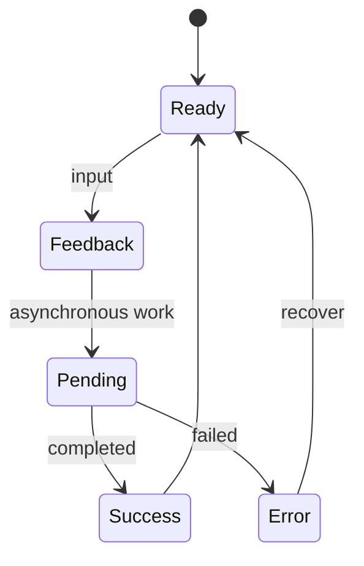

# Motion & Interaction

**Source class:** supplemental professional guidance plus contextual synthesis from `emilkowalski/skills` (MIT); accessibility behavior is normative. The supplied linux.do series has no Motion & Interaction topic. See [Provenance](../references/provenance.md).

## Canonical terms and adjacent boundaries

| Term | Boundary |
| --- | --- |
| **Transition / keyframe animation** | Interpolation between state values / authored timed sequence; transitions retarget more naturally. |
| **Microinteraction** | Contained trigger-feedback-state loop around one task/control. |
| **Feedback / state change** | Evidence that input was heard / durable system condition. Feedback must not imply completion early. |
| **Duration / delay / easing** | Time span / wait before start / rate-of-change curve. |
| **Spring / damping / response** | Physics-based interpolation / oscillation control / speed of settling; a spring has no fixed semantic duration. |
| **Choreography / stagger** | Coordination / offset start times across related elements. |
| **Spatial continuity** | Preserved perceived relationship between source, movement, and destination. |
| **Interruptibility / reversal** | Ability to redirect from the live presentation state / return without a jump or velocity discontinuity. |
| **Velocity handoff / momentum projection** | Carry release velocity into settling / estimate where a gesture is heading. |
| **Direct manipulation / gesture / rubber-banding** | One-to-one content tracking / recognized input movement / progressive resistance past a boundary. |
| **Reduced motion** | Equivalent response that limits non-essential vestibular movement while preserving state, feedback, and task. |
| **Interaction state** | Default, hover, focus-visible, active, disabled, loading, selected, validation, success, error, or other condition. |

## Concise definition

**Motion & Interaction** defines how interfaces respond over time and across input methods, including feedback, state transitions, direct manipulation, interruption, focus, announcements, and reduced-motion equivalents.

## Why it matters

Good interaction makes cause, state, and spatial relationship understandable. Unsystematic motion delays tasks, contradicts program state, hides focus, triggers vestibular symptoms, drops frames, and creates inconsistent personality.

## Visual model



The state model is authoritative; visual motion expresses it rather than replacing it.

## Decisions and tradeoffs

### Restraint-first gate

1. **Should motion exist?** Judge task and frequency. These are starting heuristics, not policy until adopted:

   | Exposure | Starting judgment |
   | --- | --- |
   | Very frequent or keyboard-driven (roughly 100+/day) | Instant or no motion |
   | Frequent (tens/day) | Near-imperceptible feedback or none |
   | Occasional | Standard transition may help |
   | Rare/first-time | A bounded delight budget may apply |

2. **Name the purpose:** continuity, orientation, state indication, explanation, feedback, preventing a jarring change, or rare delight. If no purpose survives, keep it static.
3. **Select the mechanism:** simplest mechanism compatible with state, interruption, performance, platform, and project dependencies. Adapters map this to CSS/WAAPI, a detected motion library, or native tools.
4. **Write the contract:** trigger, start/end state, affected properties, duration/easing or spring, interruption, reversal, focus, announcement, pointer/keyboard/touch behavior, and reduced-motion equivalent.
5. **Inspect:** normal speed, slowed speed/frame-by-frame, and real device for gestures when available.

### Interaction judgment

- Respond immediately to input while committing the action at the correct event boundary. Direct manipulation tracks one-to-one, respects grab offset, and preserves user agency.
- Animate from the live presentation state. Springs suit velocity-bearing, interruptible gestures; predetermined transitions suit stable state changes.
- Preserve spatial paths and origin when they explain source/destination. Centered or crossfaded behavior may be correct when no source anchor exists.
- Make user-decision phases deliberate and system responses quick. Exit may be faster than entry when that improves task flow.
- Use transform/opacity for many visual changes because they often avoid layout work, but verify the actual platform pipeline and semantics rather than treating a property list as law.
- Coordinate multimodal feedback only when causal, synchronized, useful, and platform-appropriate.
- Match motion intensity to concept, brand, platform, task frequency, and implementation capacity. Perpetual motion is a low-frequency contextual option, not a baseline.

### Contextual value candidates

Exact source values are starting candidates to test, never normative rules: press feedback around 100–160ms; tooltips/popovers 125–200ms; dropdowns 150–250ms; larger overlays 200–500ms; short group staggers around 30–80ms. Use project tokens first. A review may flag unexplained deviation but blocks only for adopted policy or demonstrated accessibility, usability, or performance failure.

## Framework-neutral implementation guidance

A motion token records purpose, exposure tier, duration/easing or spring parameters, affected properties, interruption/reversal, input capability, and reduced-motion equivalent. A state matrix records entry trigger, visual change, semantics, focus, announcement, input behavior, and exit precedence.

```text
Trigger → immediate feedback → pending state → success/error → recovery
          ↘ reduced-motion response preserves the same meaning ↗
```

Keep programmatic state and focus independent of animation lifecycle. Gate hover behavior by actual input capability. Stack-specific recipes belong only in the matching adapter.

## Accessibility implications

- WCAG 2.2 SC 2.3.3 requires users to disable non-essential animation triggered by interaction.
- SC 2.2.2 covers pause/stop/hide for qualifying moving, blinking, scrolling, or auto-updating content; SC 2.3.1 limits flashing.
- SC 2.5.1 and 2.5.7 require alternatives for path-based/multipoint gestures and dragging where applicable.
- Motion cannot be the only state cue. Preserve text, semantics, non-motion visuals, focus visibility, and status/error announcements under SC 4.1.3 where applicable.
- Honor user motion preferences. Reduced motion means fewer/gentler responses: replace large translation, parallax, overshoot, or ambient loops while preserving useful opacity/color/static feedback.

## Common failure modes

- Animation exists because a library is installed → no user purpose.
- Loading visual starts before pending state → visual and program state diverge.
- Fixed sequence ignores interruption → rapid input causes jumps or lockout.
- Reduced mode deletes feedback → input appears unacknowledged.
- Hover reveals required behavior → touch/keyboard users miss it.
- Exit leaves disappearing content focusable → users act on a vanishing control.
- Motion announces success before completion → duplicate/destructive actions follow.
- Every component invents timing/spring values → personality and preferences fragment.
- Review checks code only at normal speed → origin, velocity, and crossfade defects remain hidden.

## Agent-ready wording and acceptance checks

> Define or review Motion & Interaction for **[flow/component]** from its state model. Run the restraint gate, name each accepted purpose, and list rejected opportunities. Specify trigger, mechanism, properties, timing or spring, interruption/reversal, focus, announcement, input capability, and reduced-motion equivalent. Use project tokens first; label source values as contextual candidates. Render at normal and slowed speed and record Before / After / Why evidence.

**Accept when:** every motion has a named purpose and exposure judgment; rejected opportunities are visible; state/focus/announcements remain correct without motion; interruption and reversal are continuous; pointer/keyboard/touch paths work; reduced motion preserves meaning; rendered inspection shows no jank or misleading timing.
