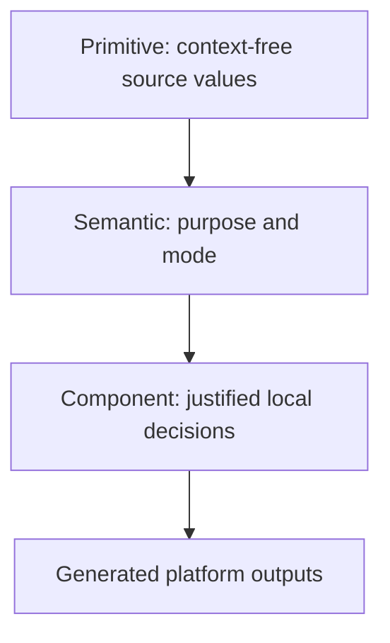

# Systemize

Use **Systemize** to create or evolve reusable capability: foundations, tokens, components, patterns, governance, versioning, migration, adoption, or cross-product architecture. Produce a phased system, not an indiscriminate catalog.

## 1. Charter

Define user/product outcomes, principles that resolve tradeoffs, supported products/platforms/brands/locales/modes, accessibility target, content/performance/release constraints, ownership, consumers, baseline, success measures, and non-goals.

**Exit:** Scope, ownership, constraints, non-goals, baseline, and measurable outcomes are explicit.

## 2. Discover the real system

Use project evidence and explicit direction to detect existing tokens, packages, components, conventions, accessibility contracts, and workarounds. Aesthetic resemblance is not evidence of a design system. Separate intentional product/brand variation from accidental divergence.

When a compatible official package or established internal system exists, use it as the structural base. Mix systems only through an explicit seam that records compatibility rationale, ownership, token mapping, interaction semantics, and migration responsibility.

**Exit:** The existing structural base, gaps, exceptions, and compatibility seams are evidence-backed.

## 3. Diagnose the inventory

Inventory representative flows, components, patterns, states, content, foundations, accessibility behavior, and overrides. Rank work by **usage × user risk × inconsistency × reuse leverage**, moderated by effort, migration risk, and confidence.

**Exit:** Evidence selects the first foundation slice and vertical pilot.

## 4. Establish all eight foundations

Define in-scope decisions for Typography, Color System, Grid & Layout, Spacing, Imagery, Iconography, Motion & Interaction, and Content & UX Writing. Record accessibility criteria, content behavior, responsive rules, and provenance for each.

Use portable token layers:

Keep typed source data DTCG-compatible. Document naming grammar, types, aliases, mode strategy, ownership, descriptions, deprecation, validation, and pairwise relationships. Component tokens exist only when shared semantics cannot express a stable exception. Generated CSS variables or platform resources are outputs, not the contract.

**Exit:** The pilot resolves through semantic decisions without unexplained hard-coded values, cycles, or mode gaps.

## 5. Build a vertical pilot

Select a real high-leverage flow. Specify only its required components and patterns. Every component covers purpose/non-use, anatomy, slots, variants, sizes, meaningful states, input behavior, focus/announcements, responsive behavior, content rules, motion/reduced motion, token dependencies, extension boundaries, and accessibility tests. A pattern additionally covers sequence, cross-component state, recovery, and task outcome.

**Exit:** The pilot works end to end, passes its contract, and hides no unresolved foundation decision as a local override.

## 6. Document and enable contribution

Publish when-to-use/non-use, anatomy, content, states, responsive behavior, accessibility, tokens, implementation adapters, examples, and change history. Define evidence intake, design/engineering/accessibility review, decision owner, response target, and exception expiry.

**Exit:** A consumer can adopt and a contributor can propose change without private guidance.

## 7. Version and migrate

Define compatibility and release policy for token source, generated outputs, components, and documentation. Breaking changes include replacement, mapping or automation where feasible, examples, deprecation window, cohorts, communication, rollback, telemetry, owner, removal criteria, and exception handling.

**Exit:** Every legacy use has a route, owner, compatibility boundary, rollback, and measurable removal condition.

## 8. Adopt

Adopt by valuable flow or product slice rather than renaming values without user benefit. Bound compatibility layers in time. Measure semantic-token use, override rate, high-use component coverage, accessibility defects, duplicates, lead time, migration progress, and consumer/contributor outcomes with a source and cadence.

**Exit:** Adoption cohorts and success evidence are operating, not merely planned.

## 9. Govern and measure

Review adoption, overrides, exceptions, defects, contribution throughput, duplicate patterns, deprecated inventory, and outcome metrics. Promote recurring exceptions only with evidence; retire unused tokens and variants through deprecation.

**Completion:** Goals connect to diagnosed evidence, all eight foundations, portable token architecture, a vertical pilot, contribution, versioning, migration, adoption, governance, and measurements; every phase has an owner and exit criterion.
